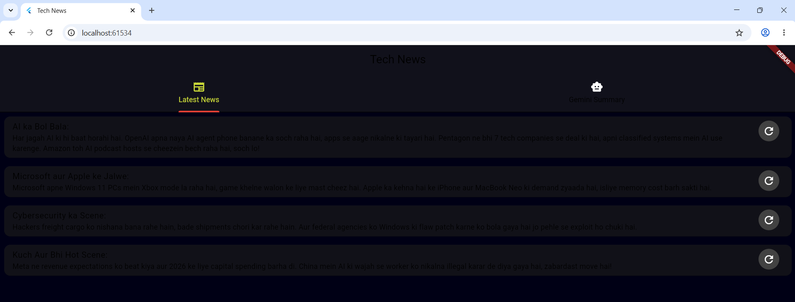

# Tech News - Flutter App with Gemini AI Integration

A Flutter application that displays tech news from **two data sources**:
1. **REST API** - Latest tech news summaries
2. **Gemini AI** - AI-curated summaries in Pakistani Roman Urdu

Built with **BLoC Architecture** and Google's Generative AI API.
## Group Members
22k-4236
22k-4460
22k-4584

## 📱 Screenshots

### Latest News Tab (REST API)

*Shows tech news items fetched from REST API with refresh functionality*

### Gemini Summary Tab (AI)
